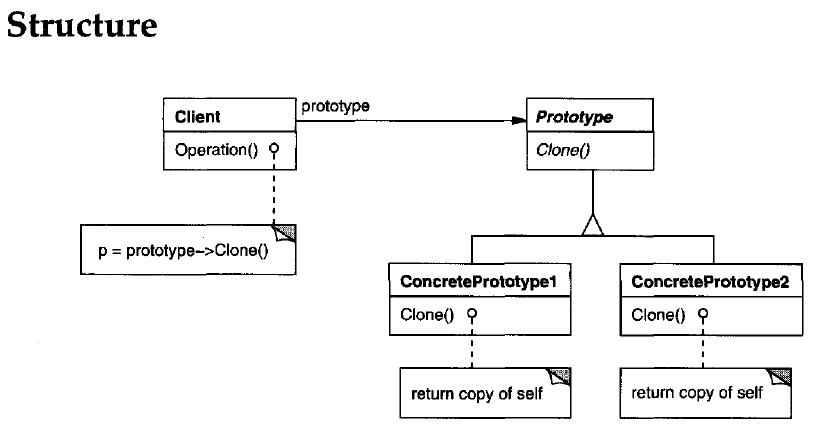

## Prototype
**Prototype is a creational design pattern that lets you copy existing objects without making your code dependent on their classes.**

> (In Java this typically means using the clone() method, or deserialization when you need deep copies.)

> A key aspect of this pattern is that the client code can make new instances without knowing which specific class is being instantiated.

## When to use Prototype pattern?
- Use the Prototype Pattern when creating an instance of a given class is either expensive or complicated.
- Use the Prototype pattern when your code shouldn’t depend on the **concrete classes** of objects that you need to copy.
- Use the pattern when you want to reduce the number of subclasses that only differ in the way they initialize their respective objects.
    - The Prototype pattern lets you use a set of pre-built objects configured in various ways as prototypes. Instead of instantiating a subclass that matches some configuration, the client can simply look for an appropriate prototype and clone it.

## Use Case: Graphic Design Software

Imagine you're developing graphic design software that allows users to create and manipulate various shapes, such as circles, rectangles, and triangles. Each shape object has properties like color, size, and position. Implementing the Prototype Pattern can help you manage the creation of shape objects efficiently.

> The ``ShapeManager`` class manages a collection of prototype shapes. You can add shapes to the manager and retrieve clones of those shapes using their keys.
## Solution
Here’s how it works: you create a set of objects, configured in various ways. When you need an object like the one you’ve configured, you just clone a prototype instead of constructing a new object from scratch.

The Prototype pattern **delegates** the cloning process to the actual objects that are being cloned. The pattern declares a common interface for all objects that support cloning. This interface lets you clone an object without coupling your code to the class of that object. Usually, such an interface contains just a single ``clone`` method.

> Designs that make heavy use of **Composite** and **Decorator** can often benefit from using **Prototype**. Applying the pattern lets you clone complex structures instead of re-constructing them from scratch.

## PROTOTYPE BENEFITS
- Hides the complexities of making new instances from the client.
- Provides the option for the client to generate objects whose type is not known.
- In some circumstances, copying an object can be more efficient than creating a new
object.