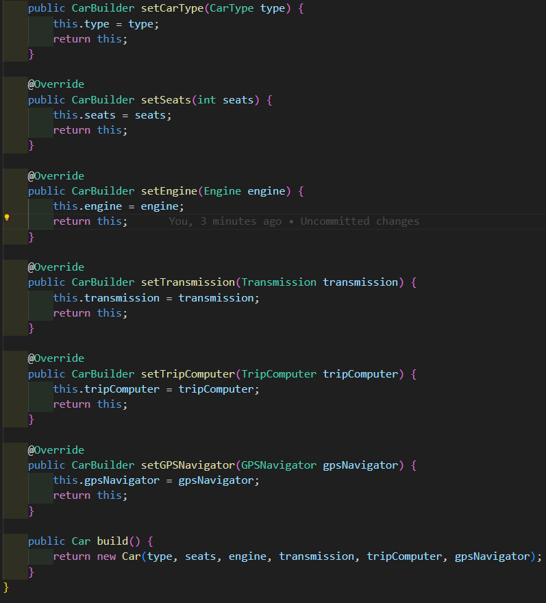
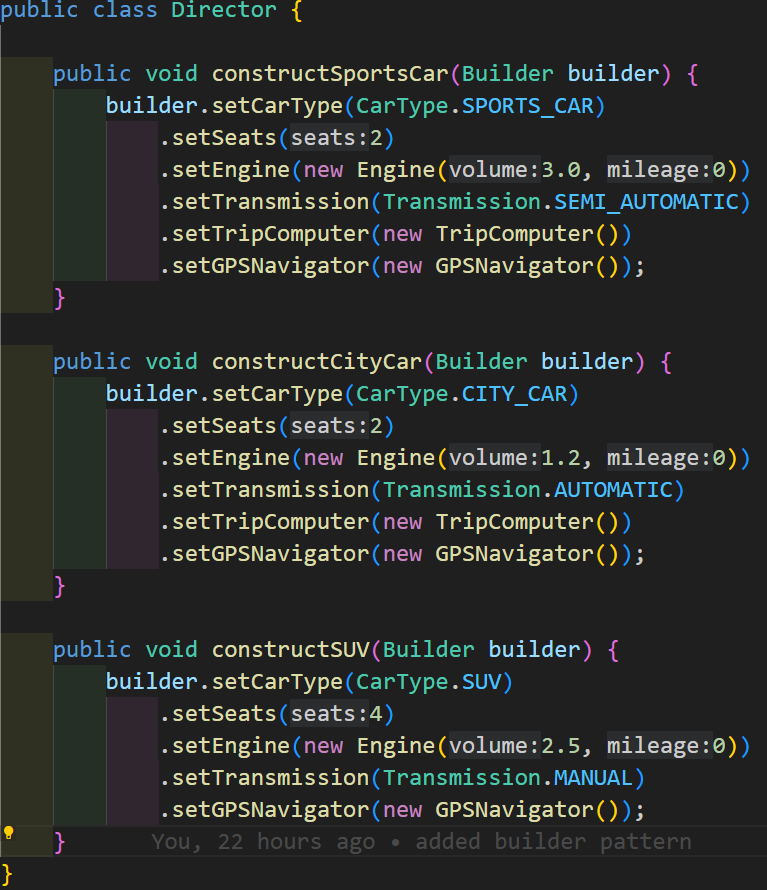
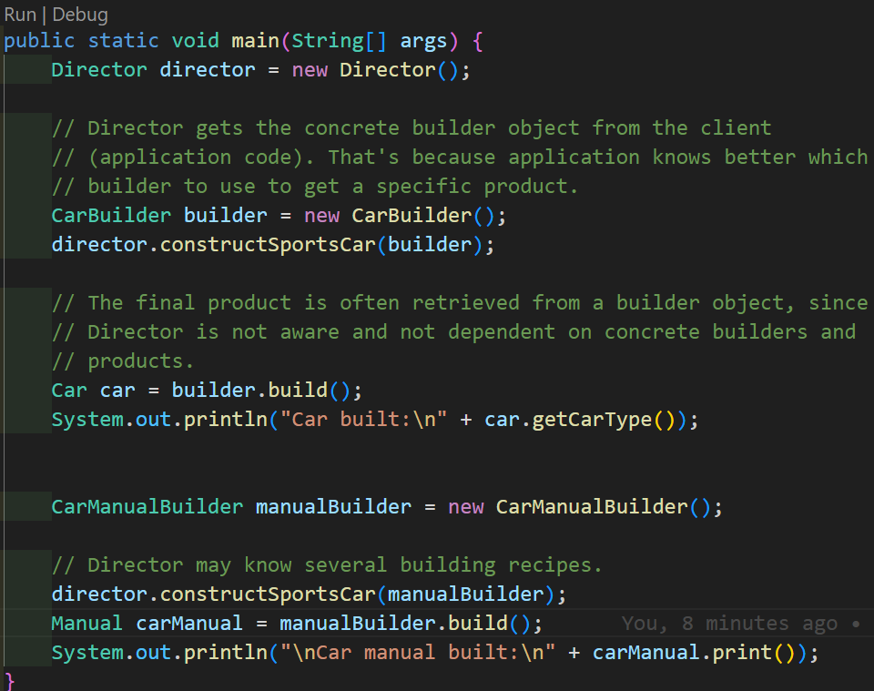
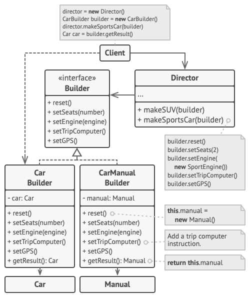

## Builder
**Use the Builder Pattern to encapsulate the construction of a product and allow it to be constructed in steps.**

> Unlike other creational patterns, Builder doesn’t require products to have a common interface. That makes it possible to produce different products using the same construction process.

## Why use the Builder Pattern?
we encapsulate the creation of the product in an object (let’s call it a builder), and have our client ask the builder to construct the product structure for it.

## Step-by-step car production
### problem
Initialization of many fields of the object is usuallay buried inside a monstrous constructor.
eg: 
```
    Car car = new Car(id, brand, model, color, nbDoors, screenType, weight, height);
    Car car = new Car(id, brand, null, color, nbDoors, null, weight, null);
```
> We may not need to fill all the fields of an object.

### Solution
Extract the object construction out of its own class and move it to a separate object called builder.
<br>
In this example, the Builder pattern allows step by step construction of different car models.

Builder example



> inside our builder we will have the same fields we have inside our Car class. however, each field will have a reserved setter method. in addition to these methods we will have a build method which returns an instance of the object this builder is supposed to create.

The example also shows how Builder produces products of different kinds (car manual) using the same building steps.

**The Director controls the order of the construction.** It knows which building steps to call to produce this or that car model. It works with builders only via their common interface. This allows passing different types of builders to the director.

> Director hides the details of the product construction from the client code.

Director example



The end result is retrieved from the builder object because the director can’t know the type of resulting product. Only the Builder object knows what does it build exactly.

Client code example



This example of the Builder pattern illustrates how you can reuse the same object construction code when building different types of products, such as cars, and create the corresponding manuals for them.




## BUILDER BENEFITS
- Encapsulates the way a complex object is constructed.
- Allows objects to be constructed in a multistep and varying process (as opposed to one-step factories).
- Hides the internal representation of the product from the client.
- Product implementations can be swapped in and out because the client only sees an
abstract interface.