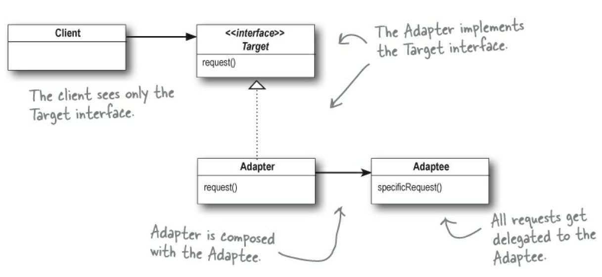
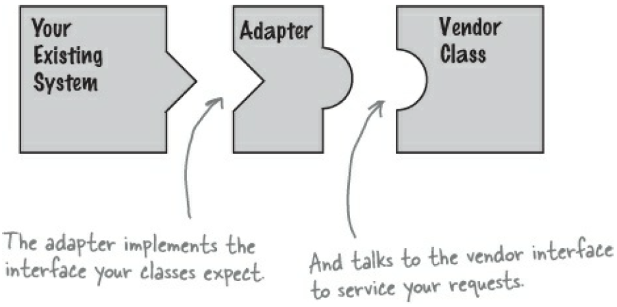

# Adapter pattern
Adapter is a structural design pattern that allows objects with incompatible interfaces to collaborate.

> It acts as a bridge between two interfaces, allowing them to collaborate without needing to modify their source code.

UML Class diagram:

## Example Use Case: Legacy Payment System Integration

Imagine you're working on a new e-commerce platform that needs to integrate with a legacy payment system. However, the payment system's interface is outdated and incompatible with your modern codebase. Implementing the Adapter Pattern can help you bridge the gap and make these systems work together seamlessly.

Let's illustrate this with an example:

Suppose you have a modern ``PaymentGateway`` interface, And you have a legacy ``LegacyPaymentSystem`` with a different interface.

You need to integrate the legacy payment system into your modern e-commerce platform that expects a ``PaymentGateway`` interface.

Here you can use the Adapter Pattern to achieve this.

In this example, the ``LegacyPaymentAdapter`` class implements the ``PaymentGateway`` interface, acting as an adapter for the legacy ``LegacyPaymentSystem``. It adapts the method signatures and converts the parameter types to match the legacy system's interface. This way, you can seamlessly integrate the legacy payment system into your modern e-commerce platform without altering the existing codebase of either system.

> The adapter acts as the middleman by receiving requests from the client and converting them into requests that make sense on the vendor classes.

> This approach has the added advantage that we can use an adapter with any subclass of the adaptee.